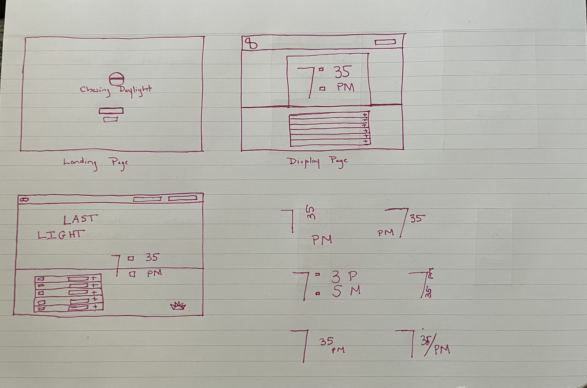
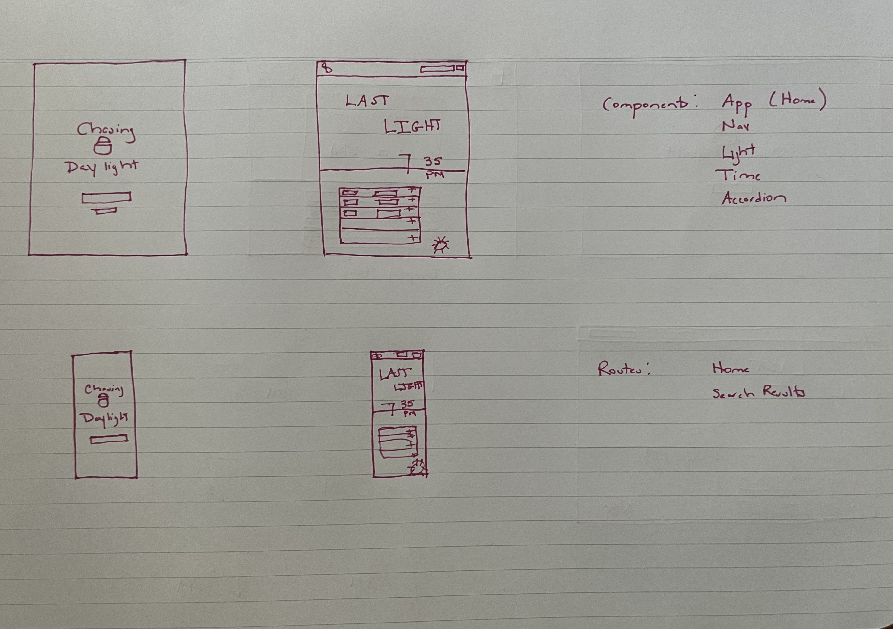

# Chasing Daylight

## Description
As someone who enjoys exercising and spending time outdoors, I've often found it challenging balancing work and ensuring I actually get out the door before the last bit of daylight is gone. This issue is compounded during the late fall and winter months.

While there are multiple resources to look up sunrise and sunset times for a location, most of these tack it on as an afterthought. It usually appears listed in a chart at the bottom of a weather report or buried deep in multiple lines looking at a full month view of times.

The goal of the Chasing Daylight site is to display first light, last light, and other marked times in a bold, graphical way that makes it easy to tell at a glance how much sunlight is left (or how long until it's back).

## Wireframes

## APIs
- [Sunrise and sunset times API](https://sunrise-sunset.org/api) by Sunrise-Sunset
- [Geocoding API](https://api-ninjas.com/api/geocoding) by API Ninjas
- [Timezone API](https://api-ninjas.com/api/timezone) by API Ninjas

## Technologies Used
- HTML
- CSS
- React

## MVP
The MVP will take a city input by name and using the Geocoding and Timezone APIs convert it to latitude and longitude coordinates and local timezine.

The coordinates and timezone will be passed to the Sunrise and sunset times API and output the times for the following:
- Astronomical twilight begins
- Nautical twilight begins
- Civil twilight begins
- Sunrise
- Solar noon
- Sunset 
- Civil twilight ends
- Nautical twilight ends
- Astronomical twilight ends

The most prominent area of the screen will boldy display last light (astronomical twilight ends) for the day. This area will have a black background color to provide high contrast and command attention.

Below that an accordion component will output the full list of sunphase times above, and expand to show a definition of that sunphase. The background of this area will update based off the current time phase (sky blue for solar noon, dark blue for night, or sunrise/sunset colors).

## Post-MVP

- An hours until first light/last light counter will appear at the bottom of this area.
    - If counting down to last light, the last 60 minutes will be emphasized with red text.
- Browser will have added capability to pull current location and not require city input
- A date search will allow users to view days other than today.

## Acknowledgments
- Yogesh Chavan, ["How to Build an Accordion Menu in React from Scratch"](https://www.freecodecamp.org/news/build-accordion-menu-in-react-without-external-libraries/)
- Jayanth Somineni, ["Different Ways to Display Images in React.js Apps"](https://builtin.com/software-engineering-perspectives/react-js-image)
